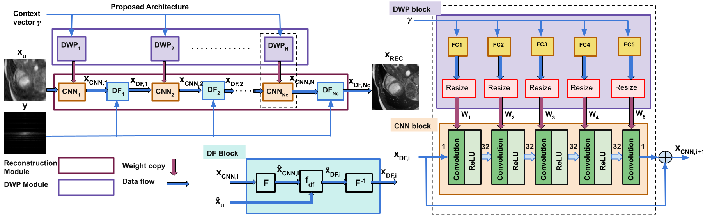

# MAC-ReconNet-Multiple-Acquisition-Context-based-CNN
### *A single network that uses dynamic weight prediction for multiple acquisition context-based MRI Reconstruction* 
> [MAC-ReconNet:  A Multiple Acquisition Context based Convolutional Neural Network for MR Image Reconstruction using Dynamic Weight Prediction](http://proceedings.mlr.press/v121/ramanarayanan20a.html) (MIDL 2020) 


## Dependencies
#### Packages
* *PyTorch*
* *TensorboardX*
* *numpy*
* *tqdm*
 
An exhaustive list of packages used could be found in the *requirements.txt* file. Install the same using the following command:

```bash
 conda create --name <env> --file requirements.txt
```

## Folder hierarchies 

Folder hierarchy to set up datasets (input, label pairs)
--------------------------------------------------------

Each Acquisition context has three settings - DATASET_TYPE, MASK_TYPE and acceleration factor represented in short ACC_FACTOR

DATASET_TYPE indicates the different types of anatomy images that we would like to combine in a single training
MASK type indicates the kind of mask pattern which we use in the training. 
ACC_FACTOR - the acceleration factor for reconstruction 

<base_path>/datasets/DATASET_TYPE/MASK_TYPE/ACC_FACTOR

Example:
For example, 1. if we intend to combine T1 and FLAIR as two different data types of a subject then we could set this as DATASET_TYPE folders are 'mrbrain_t1' and'mrbrain_flair'. 2. if we use two mask types - Cartesian and Gaussian, then MASK_TYPE folders are cartesian, gaussian. 3. If we intend combining three acceleration factors, 4x, 5x and 8x, then ACC_FACTOR folders are acc_4x, acc_5x and acc_8x.
For these settings the folder hierarchy is


												datasets
													|
							-----------------------------------------------------
							|													|
						mrbrain_t1											mrbrain_flair
							|													|
					----------------							---------------------------------
					|				|							|								|
				cartesian		gaussian					cartesian						gaussian
					|				|							|								|
		train, validation		train, validation			train, validation			train, validation
		----------------		----------------			---------------				-----------------
		|		|		|		|		|		|			|		|		|	   		|		|		|
	acc_4x	acc_5x	acc_8x	acc_4x	acc_5x	acc_8x		acc_4x	acc_5x	acc_8x		acc_4x	acc_5x	acc_8x


The folder hierarchy for the under-sampling masks are stored in a folder seperately as follows.
<base_path>/us_masks/DATASET_TYPE/MASK_TYPE/mask_<ACC_FACTOR>.npy

For example, to stored the 4x mask for Gaussian mask type for MRBrains FLAIR is stored as follows.

<base_path>/us_masks/mrbrain_t1/gaussian/mask_4x.npy

Note that if the mask is made on the fly for a given mask type and acceleration factor, then accordingly the changes needs to be done in dataset.py to generate random mask and based on that generate the under-sampled images. In that case, mask need not be stored.


Folder hierarchy for experiments folder
----------------------------------------

The hierarchy is similar to the one for datasets but in the experiments/<model_name>/results folder

<base_path>/experiments/<model_name>/results/DATASET_TYPE/MASK_TYPE/ACC_FACTOR

<model_name> - this is the folder with the model name in which the model files are stored.
results - this is the folder in which all the predicted test files are stored in .h5 format for each acquisition context.

## Train code 

```bash
sh train_combinedall.sh
```

## Test code 

```bash
sh valid_combinedall.sh
```

## Evaluate PSNR / SSIM metrics 

```bash
sh evaluate_combinedall.sh
```

## Display PSNR / SSIM metrics 

```bash
sh report_collect_combinedall.sh
```

 ## Citations
If you use the MAC-ReconNet in your research, please consider citing:
```
@InProceedings{MAC-ReconNet-MIDL2020,
  title = 	 {{MAC-ReconNet: A Multiple Acquisition Context based Convolutional Neural Network for MR Image Reconstruction using Dynamic Weight Prediction}},
  author =       {Ramanarayanan, Sriprabha and Murugesan, Balamurali and Ram, Keerthi and Sivaprakasam, Mohanasankar},
  booktitle = 	 {Medical Imaging with Deep Learning},
  pages = 	 {696--708},
  year = 	 {2020},
  volume = 	 {121},
  series = 	 {Proceedings of Machine Learning Research},
  month = 	 {06--08 Jul},
  pdf = 	 {http://proceedings.mlr.press/v121/ramanarayanan20a/ramanarayanan20a.pdf},
  url = 	 {
http://proceedings.mlr.press/v121/ramanarayanan20a.html
}
}
```
